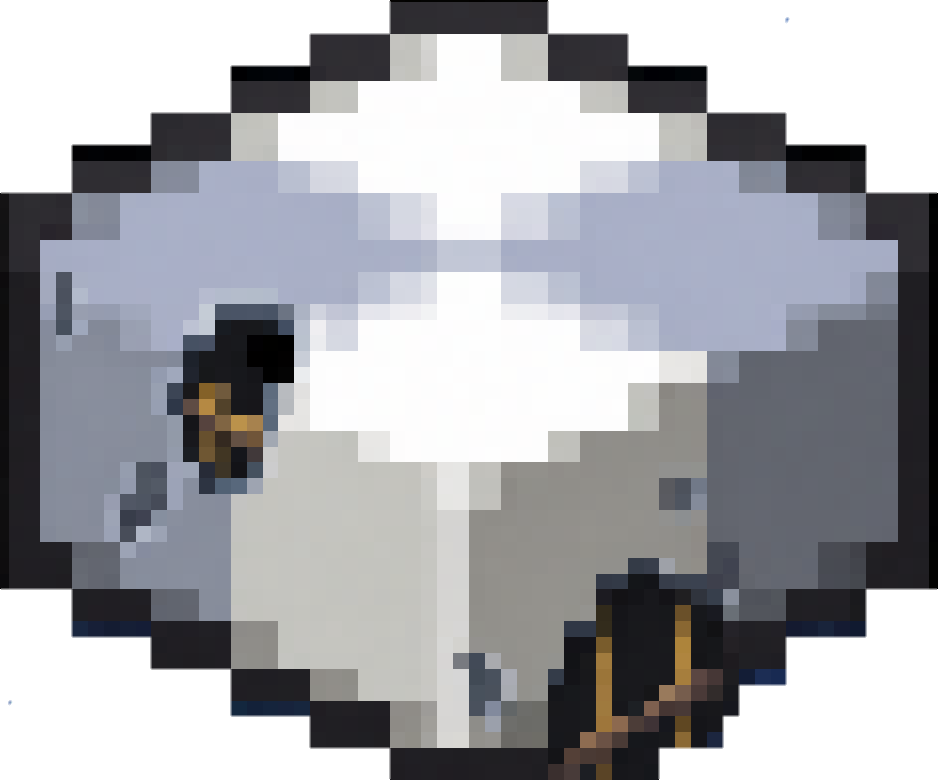

  

# Ponder 1.7.10
 
 
 

Ponder is a system for creating interactive in-game guides through scripted 3D scenes.

This repository is a **1.7.10 adaptation** of the original Ponder system by the [Creators of Create](https://github.com/Creators-of-Create) and is currently integrated into the ReCreate project.

 ---

 ## Project Status 
 This is an early and incomplete port. 
- Core structure exists 
- Scene system is under adaptation 
- Rendering pipeline is incomplete 
- Instruction system is in development 

--- 

## Integration 
This is not a standalone library. It exists inside: [ReCreate](https://github.com/Gordon-Frohman/ReCreate) (Create 1.7.10 port)

--- 

## Dependencies 
- https://github.com/Gordon-Frohman/ReCreate
- https://github.com/Gordon-Frohman/Metaworlds-Mixins

## Additional documentation: 
- Core architecture: https://deepwiki.com/Gordon-Frohman/Metaworlds-Mixins/2-core-architecture
- SubWorld system: https://deepwiki.com/Gordon-Frohman/Metaworlds-Mixins/2.1-subworld-system
- Rendering system: https://deepwiki.com/Gordon-Frohman/Metaworlds-Mixins/4-rendering-system
- Technical implementation: https://deepwiki.com/Gordon-Frohman/Metaworlds-Mixins/6-technical-implementation

--- 

## Disclaimer
This is an unofficial adaptation for Minecraft 1.7.10. All original *concepts* belong to the Creators of Create. 
