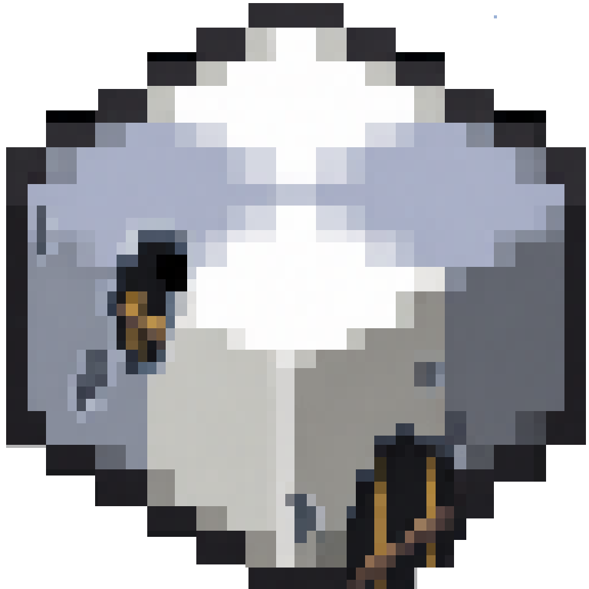

 
 

# Ponder 1.7.10

 

 

Ponder is a system for creating interactive in-game guides through scripted 3D scenes.

This repository is a **1.7.10 port** of the original Ponder system by the [Creators of Create](https://github.com/Creators-of-Create) and is currently integrated into the [ReCreate](https://github.com/Gordon-Frohman/ReCreate) project.

---

## Project Status (In Development)

> **Note:** This project is currently in the process of being ported and restructured for version 1.7.10, using **[Metanip](https://github.com/Apostrcfo2/Ponder-1.7.10/tree/main/src/main/java/net/createmod/metanip)** as the central module (replacing the former Catnip). The features listed below are actively being implemented.

---

## Technical Specifications (Planned/In Development)

Unlike modern versions that rely on simulated in-memory worlds, this port leverages the **MetaWorld Mixins** infrastructure to ensure visual fidelity and performance within the Minecraft 1.7.10 engine.

### Rendering Architecture
* **Scene Engine:** The modern `Catnip LevelWrappers` system is being replaced by MetaWorld's **SubWorld** system. Each Ponder scene will be instantiated as a legitimate `SubWorldClient`, providing native support for lighting, entities, and particles. *(In Development)*
* **Video Pipeline:** The implementation utilizes `RenderGlobalSubWorld` to manage the 3D rendering lifecycle within `GuiScreen` interfaces. This approach inherits full compatibility with the **[Angelica](https://github.com/GTNewHorizons/Angelica)** optimization mod (Sodium/Iris port). *(In Development)*
* **Transformations:** Matrix manipulations are handled via **JOML** and **OpenGL 1.1**, effectively backporting the modern `PoseStack` system to the classic Minecraft matrix stack. *(In Development)*

### ReCreate Integration
* **Contraptions:** Native support for rendering ReCreate's moving structures within Ponder scenes is achieved through MetaWorld's entity physics and rendering system. *(Pending Implementation)*
* **Data Mapping:** A specialized mapping system translates modern `BlockStates` to the legacy `Block + Metadata` (0-15) model, with extended state support provided via `TileEntities` where necessary. *(In Development)*

### Core Dependencies

| Dependency | Functional Role | Status |
| :--- | :--- | :--- |
| **[MetaWorld Mixins](https://github.com/Gordon-Frohman/Metaworlds-Mixins)** | SubWorld Engine and Coordinate Transformation. | Active |
| **[JOML](https://github.com/JOML-CI/JOML)** | Mathematical library for 4x4 matrix calculations. | Active |
